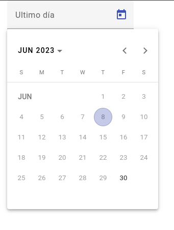

# Last Day Of Month Date Picker in Angular

This project was generated with [Angular CLI](https://github.com/angular/angular-cli) version 15.0.4 and Angular Material. It includes a custom datepicker component that allows users to select only the last day of each month.

## Features

- Custom datepicker component that restricts date selection to the last day of each month.
- Integration with Angular Material for seamless UI design.
- Configurable options to select different dates.

## Development server

Run `ng serve` for a dev server. Navigate to `http://localhost:4200/`. The application will automatically reload if you change any of the source files.

